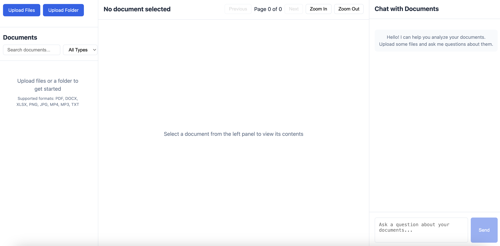

# Klarity Work Trial

Demo 1: https://youtu.be/ob8kO6NCtzM

Shows asking odf questions and ask ai feature to change things

This repository is used as a work trial sandbox where all experiments, proofs-of-concept, and production-oriented skeletons are developed and refined. Below is an overview of the repository structure, the current inner workings of each folder, and the status of our work trial.

### ask-ai-framework

**Purpose:** Skeleton code for when the feature hits production

- **Interactive Notebooks:** These notebooks cover document ingestion, preprocessing, transformation, analysis, and evaluation processes. They are the primary space where end-to-end workflows are prototyped.
- **Modular Experimentation:** Individual stages – such as file processing, content extraction, and downstream analytics – are developed and tested here in modular fashion.
- **Current Status:** The skeleton design is set up, and notebooks are gradually being populated with functional pipelines. At this stage, work is focused on outlining workflows and validating proof-of-concept modules.

The rest of the repo is pure chaos

1. Data Collection

- Downloaded Pfizer dataset from Kaggle

2. Data Preperation

- Research on OCR

3. Data Embedding

- LLM Embeddings
- OpenAIEmbeddings

4. Data Indexing
   Dense Vector Index (stores more features enables better search while doing ANN in retrieval)

This is the UI

## Setup

## License

This project is licensed under the [Your License Name] License.
